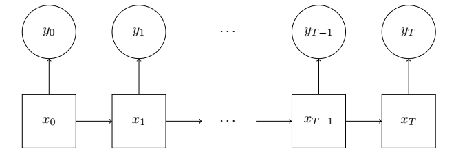
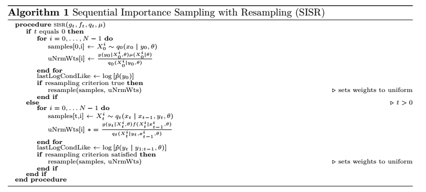

# Summary

It takes time and effort to implement different particle filters well, and this is true for two reasons. First, the mathematical notation used to describe them can be complex. The second reason is that, even if they are correctly implemented, they can be quite slow, limiting the number of tasks that they would be feasible for. 

The ``PF`` library, described in this short paper, addresses these two issues by providing **class and function templates** that offer fast implementations for a variety of particles filtering algorithms. Each of these algorithms are useful for a wide range of time series models. 

In this library, each available particle filtering algorithm is provided as a class template. Once the data analyst has a specific state-space model in mind, he will pick which type(s) of particle filtering algorithm(s) to associate with that model. For each model-particle filter pair, he will write a class for his model that inherits from the particle filter's class. The details of each algorithm are abstracted away, and each algorithm's class template's required functions are pure virtual methods, meaning that the data analyst will not be able to omit any function that is required by the algorithm. Full documentation is available at [https://tbrown122387.github.io/pf/](https://tbrown122387.github.io/pf/).


# Statement of Need

This is by no means the first ``C++`` library to be offered that provides particle filter implementations. Other options include ``LibBi`` [@libbi], ``Biips`` [@todeschini2014biips], ``SMCTC`` [@Johansen:2009:JSSOBK:v30i06] and ``Nimble`` [@doi:10.1080/10618600.2016.1172487]. The goals of these software packages are different, though--users of these libraries write their models in a scripting language, and that model file gets parsed into ``C++`` code.

``PF``, on the other hand, besides providing a different assortment of particle filters, does not provide a parser, nor does it interface with any interpeted language. It is designed for users that prefer to work in ``C++``. It can be useful for instantiating individual particle filters, but it is also designed in an object-oriented manner to facilitate the implementation of algorithms that update many particle filters in parallel. Some examples of opportunities include particle filters with parallelized resampling schemes  [@1453776,1309.2918], particle Markov chain Monte Carlo algorithms [@pmcmc], importance sampling "squared" [@issquared], and the particle swarm algorithm [@pswarm]. 

The library is "header-only", which means it is comprised of only header files. As a result, it is easily added to other ``C++`` software projects. The only extra steps are `#include`-ing relevant headers, and pointing the compiler at the `include/pf/` directory. This directory stores all necessary code, although there there are unit tests and examples provided as well. 


# Statement of Need

Particle filters are recursive algorithms that are used in the analysis of state-space models, a particular class of time series models that feature latent random variables called "states", "signals", "memory" or "codes."  In many modeling tasks where these types of models are used, the state process represents some intuitive and physically-meaningful process.

Particle filters are used to approximate different sequences of state distributions using weighted samples. Even though they can be difficult to understand and difficult to program, particle filters are often seen as the only option for a large collection of state-space models, and unfortunately, these difficulties has discouraged a wider adoption of their use.

Particle filters work by iterating over observed data in time, and storing a large, constantly-evolving collection of weighted samples. Every moment an observed data vector is obtained, the collection of weights and samples changes. This happens in two steps. First, old particles are "mutated" (or "propagated") into new particles. This means that a user-chosen "proposal" or "instrumental" distribution is used to sample values of the new states using, or conditioning on, the old values. For each new state sample, its corresponding weight is updated. It becomes larger if the sample is "good," and vice versa.

These new samples and weights set the stage for the second step: "resampling." Here, unweighted samples are drawn with replacement from the current collection of weighted samples. Samples with high weights are chosen with a higher probability, and samples with low weights are chosen with a low probability. In this way, samples with large weights tend to end up being duplicated, and samples with relatively small weights tend to be discarded.


# State-Space Models

A state-space model (SSM), also known as a hidden Markov model or partially-observed Markov process, is defined by two things: an observable time series $\{y_t\}_{t=0}^T := y_{0:T}$ of length $T +1$, and an unobservable or latent time series $\{x_t\}_{t=0}^T := x_{0:T}$. Specifying a SSM requires the selection of several probability distributions all parameterized by a vector $\theta$. What are chosen are $\mu(x_0 \mid \theta)$, the first time's state distribution, along with the state transition densities, $\{f(x_t \mid x_{t-1},\theta)\}_{t=1}^T$, and the observation densities, $\{g(y_{t} \mid x_{t},\theta)\}_{t=0}^T$. The generative graph of this process is displayed in \autoref{fig:diagram}.



Constructing the joint density of the complete data, which includes both the observed and unobserved portions, is straightforward because $y_{0:T}$ are conditionally independent given the states, and because the states are assumed to possess the Markov property. Specifically, this means
\begin{eqnarray}
p(y_{0:T} \mid x_{0:T},\theta ) & = & \prod_{t=0}^T g(y_t \mid x_t,\theta ) \label{obs}
\end{eqnarray}
and
\begin{eqnarray}
p(x_{0:T} \mid \theta) & = & \mu(x_0 \mid \theta) \prod_{t=1}^T f(x_t \mid x_{t-1},\theta). \label{trans}
\end{eqnarray}
The product of (\ref{obs}) and (\ref{trans}) yields the complete data likelihood: $p(x_{0:T},y_{0:T} \mid \theta)$, and integrating out the unobserved $x_{0:T}$ from this yields the marginal likelihood $p(y_{0:T} \mid \theta)$. For more information see the tutorial by \cite{tutorial}. For a more detailed book-length description, see \cite{10.5555/1088883}, which makes use of concise measure-theoretic notation and provides many accessible proofs to its theorems.

## Algorithmic Descriptions

There are primarily two types of quantities of interest for users of particle filters. The first is a conditional expectation involving integration (or summation) with respect to the distribution of states conditioning on some observed data: $p(x_{0:t} \mid y_{0:t},\theta)$. Generally speaking, this task becomes computationally difficult when this distribution is not tractable. This does not always happen, it depends on how the conditional distributions defining the model were chosen by the data analyst. When it does not happen, Kalman filters and smoothers, and the assorted algorithms for discrete state-space hidden Markov models are quite prevalent.

This first type of quantity of interest can be further subdivided into "smoothing" and "filtering." Filtering is suitable for many real-time applications such as tracking and prediction, and is used to approximate expectations with respect to the distribution of the most recent state, conditioning on all information up to that time point. Smoothing, on the other hand, is used for retrospective analyses. ``PF`` deals exclusively with the former.

The second type of quantity consists of likelihoods. At each iteration, particle filters involve a calculation used to approximate the conditional distribution of the most recent data point, given all the previous data points. For $t \ge 1$, this can be written as $\hat{p}(y_t \mid y_{0:t-1}, \theta)$, and for $t=0$, this can be written as $\hat{p}(y_0 \mid \theta)$. Factoring the marginal likelihood as a product motivates an estimator for the entire marginal likelihood:
\begin{equation} \label{eq:1}
\hat{p}(y_{0:T}) = \hat{p}(y_0 \mid \theta) \prod_{i=1}^T \hat{p}(y_t \mid y_{0:t-1}, \theta).
\end{equation}
This quantity is often unbiased [@delmoral2004], and can be useful within algorithms that perform parameter inference [@estimationreview]. In particular, if one uses this library, particle Markov chain Monte Carlo [@pmcmc] can be programatically identical to a standard Metropolis-Hastings algorithm [@Metropolis1953], [@10.2307/2334940] with the exception that evaluations of the likelihood are replaced by the approximations provided by Equation \autoref{eq:1}.



# Using ``PF`` 

## Getting started

This section provides a fully worked example. It starts by describing how to download the software. The software can be obtained by cloning the Github repository here: [https://github.com/tbrown122387/pf](https://github.com/tbrown122387/pf). Familiarity with ``git`` is not required. It suffices to click the green "Clone or download" button, and then click "Download ZIP."

After extracting, all the code you need to build a working program is located in the `include/pf/` directory. This library is header-only, so nothing here needs to be compiled separately from your program. The only compiler requirement is that you will need to enable ``C++11`` (e.g., by including the `-std=C++11` flag). Second, this code depends on the ``Eigen`` library, and, to a lesser extent, the ``Boost`` library as well. 

## Implementing a model

Take as an example a simple stochastic volatility model with three parameters: $\beta, \phi$ and $\sigma$. These are popular for modeling a time series of the rates of return of financial instruments when the distributions of these returns have a time-varying scale. The discovery of these models is often credited to [@taylor82], and they are still extensively studied. At the time of writing this, searching "stochastic volatility" on Google scholar returns 645,000 results.

For this model, we will assume the observable rate of return $y_t$ is normally distributed, but only after conditioning on the contemporaneous state random variable $x_t$. The mean parameter of this normal distribution will remain fixed at $0$; however, the scale of this distribution will vary with the evolving $x_t$. When $x_t$ is relatively high, the returns will have a high conditional variance and be "volatile." When $x_t$ is low, the returns will be much less volatile.

We write this observational equation as
\begin{eqnarray}
y_t = \beta e^{x_t/2} z_t
\end{eqnarray}
where the collection $\{z_t\}_{t=0}^T$ are independent and identically distributed normal random variates.

The state evolves randomly through time as a simple autoregressive process:
\begin{eqnarray}
x_t = \phi x_{t-1} + \sigma z'_t.
\end{eqnarray}
The collection $\{z'_t\}_{t=1}^T$ are also assumed to be independent and identically distributed normal random variates. At time $0$, when there is no previous state value, we assume the first state follows a mean zero normal distribution with $\sigma^2/(1-\phi^2)$, and for simplicity, all of our proposal distributions match the state's distribution at the time.

The file `examples/svol_sisr.h` provides a fully worked example of writing a class template called `svol_sisr` for this model-algorithm pair. This is a class template, as opposed to a class, so that means the decision of what to pass in as template parameters has been pushed back to the code that instantiates and uses these particle filters. Even though now this code is messier than a plain class, this will benefit the data analyst in the long run because there will likely only be one file to change. Last, the SISR algorithm's header is included with `#include "sisr_filter.h"`.

Our choice of proposal distribution means that this algorithm satisfies the definition of the **Bootstrap Filter**. A demonstration of how to use a specially designed class template is given in `examples/svol_bs.h`.

```cpp
template<size_t nparts, size_t dimx, size_t dimy, typename resampT, typename float_t>
class svol_sisr : public SISRFilter<nparts, dimx, dimy, resampT,float_t>
{
public:
    using ssv = Eigen::Matrix<float_t, dimx, 1>;
    using osv = Eigen::Matrix<float_t, dimy, 1>;

    float_t m_phi;
    float_t m_beta;
    float_t m_sigma;

    rvsamp::UnivNormSampler<float_t> m_stdNormSampler;

    svol_sisr(const float_t &phi, const float_t &beta, const float_t &sigma);

    float_t logMuEv (const ssv &x1);
    ssv q1Samp (const osv &y1);
    float_t logQ1Ev (const ssv &x1, const osv &y1 );
    float_t logGEv (const osv &yt, const ssv &xt );
    float_t logFEv (const ssv &xt, const ssv &xtm1 );
    ssv qSamp (const ssv &xtm1, const osv &yt );
    float_t logQEv (const ssv &xt, const ssv &xtm1, const osv &yt );
};
```

After the type aliases, the first thing to notice inside the body of the class template is that the parameters are simple data members of the model. These need to be data members stored inside of the class because these numbers will be referenced in the class's methods' definitions. Typically, the user will choose the template parameter `float_t` to be either type `double` or type `float`.

Second is the declaration of the member `m_stdNormSampler`. This will be used in our functions as well, but only in the ones that sample random variates. All of the distributions we sample from are normal distributions; if that wasn't the case, it would be easy to add more members that sample from different distributions. This particular object is of type `rvsamp::UnivNormSampler<float_t>`. The class template we are making use of, `rvsamp::UnivNormSampler`, is defined in the file `include/pf/rv_samp.h`.

Third, there are function signatures. One is the constructor, which is simple to implement, and the rest are the statistical distributions that define the model. The names of the mathematical functions match the mathematical notation that was introduced in Section~\ref{sec:math_desc} and Section~\ref{sec:algo_desc}.

To define the constructor for the class template, be sure to 1.) call the base class's constructor, and 2.) allow user-provided model parameters to be stored as data members.

```cpp
template<size_t nparts, size_t dimx, size_t dimy, typename resampT, typename float_t>
svol_sisr<nparts,dimx,dimy,resampT,float_t>::svol_sisr(const float_t &phi,
                                                       const float_t &beta,
                                                       const float_t &sigma)
    : SISRFilter<nparts, dimx, dimy, resampT,float_t>()
    , m_phi(phi), m_beta(beta), m_sigma(sigma) { }
```
Note that `resampT`, the chosen resampling method, is provided as a type. That type will be used to declare a data member in the instantiation of the base class template.

Implementations of the class template methods are also in `examples/svol_sisr.h`. The methods that **evaluate** random variables make use of function templates provided in `include/pf/rv_eval.h`, and methods that sample pseudo-random numbers make use of class templates provided in `include/pf/rv_samp.h`.

One reason the example keeps the specific model's particle filter as a class template is to demonstrate the use of *trailing return types*, which is a feature introduced in `C++11` [@ISO:2012:III]. Take for instance the definition of the proposal distribution $q(x_0 \mid y_0, \theta)$:
```cpp
template<size_t nparts, size_t dimx, size_t dimy, typename resampT, typename float_t>
auto svol_sisr<nparts,dimx,dimy,resampT,float_t>::q1Samp(const osv &y1) -> ssv
{
    ssv x1samp;
    x1samp(0) = m_stdNormSampler.sample() * m_sigma / std::sqrt(1.-m_phi*m_phi);
    return x1samp;
}
```
This is necessary because the return type of this method, `ssv`, will depend on one of the class template's template parameters (i.e., `dimx`).

## Using a model class template

Instantiating an object with the class template defined in `examples/svol_sisr.h` is even easier. Just provide the template parameters and the constructor parameters in the correct order. For example,
```cpp
svol_sisr<5000,1,1,mn_resampler<5000,1,double>,double> sisrsvol(.91,.5,1.0);
```
instantiates the object called `sisrsvol`, which performs the SISR algorithm for the stochastic volatility model using multinomial sampling on $5,000$ particles. It sets $\phi = .95$, $\beta = .5$ and $\sigma = 1$.

This example is just for pedagogical purpose. After seeing that these type names can be quite long, it is good practice to use typedefs or type aliases, and to avoid hard coding parameter choices as much as possible. A fully-worked example of implementing our stochastic volatility model with a SISR algorithm, along with the same model using different particle filters, is provided in `examples/svol_comparison.cpp`, and is discussed later in section~\ref{sec:illustrations}.

## Advantages and disadvantages of `C++` templates

The data analyst must choose a model, a type of particle filter, a type of resampling, the number of particles, and the aforementioned proposal distributions. All of this information the user will supply when he writes the header file for his model's class. In the provided examples, our particle filter subclasses a class template instantiation of `SISRFilter`. This means that the number of particles, the dimension of the state vector, the dimension of the observations, the type of resampling, and the type of floating point numbers to use inside all of the vectors and matrices are all known at **compile time**, which has a number of advantages.

First, if a data analyst knows how many particles she will end up sampling at every iteration, that means she can use the `std::array` container. These containers are possibly faster than `std::vector`-based containers, although this will depend on the number of particles, and the compiler flags used. They also allow for data analyst to choose whether the particle filter object is to be stored on the stack or on the heap. Finally, they prohibit the costly and unnecessary resizing of the container.

The template parameters for the dimension of the observed vectors, the unobserved vectors, and the type of floating point scalars are used as the first three template arguments to the `Eigen::Matrix` class template [@eigenweb]. Again, because they are known at compile time, these sizes can be used to opt for fixed size vectors instead of "dynamic" ones. This has the benefit of speed in many situations, particularly for smaller sizes. Moreover, manipulating single precision floating point numbers is computationally cheaper than manipulating double precision ones. This savings can add up if there are many particles being used. There are downsides to this, though. If the particle filter objects are being stored on the stack, there is a possibility of stack overflow errors.

``PF`` offers several particle filters to subclass (for more information, see Table~\ref{tab:overview}). In addition to the three algorithms used in the example, there are class templates for closed-form filtering algorithms such as Kalman filtering [@kalman], [@shumwaystoffer] and the HMM filter [@baum1966], [@rabiner], as well as four different types of "Rao-Blackwellized" or "marginalized filters" [@rbpfandrieudoucet], [@Chen00mixturekalman].

| Filtering Algorithm                        | Sampling-based or Closed-form? | Available resamplers                          |   |
|--------------------------------------------|--------------------------------|-----------------------------------------------|---|
| Bootstrap Filter                           | sampling-based                 | multinomial, residual, stratified, systematic |   |
| SISR                                       | sampling-based                 | multinomial, residual, stratified, systematic |   |
| Auxiliary Particle Filter                  | sampling-based                 | multinomial, residual, stratified, systematic |   |
| Kalman Filter                              | closed-form                    | multinomial, residual, stratified, systematic |   |
| finite Hidden Markov Model                 | closed-form                    | multinomial, residual, stratified, systematic |   |
| Rao Blackwellized (Bootstrap + Kalman)     | both                           | multinomial                                   |   |
| Rao Blackwellized (Bootstrap + finite HMM) | both                           | multinomial                                   |   |
| Rao Blackwellized (SISR + Kalman)          | both                           | multinomial                                   |   |
| Rao Blackwellized (SISR + finite HMM)      | both                           | multinomial                                   |   |

The primary difference between them is which proposal distribution the user decides to use to mutate old samples into new ones. At time $0$, this distribution is denoted by $q_0(x_0 \mid y_0, \theta)$, and for $t \ge 1$, it is denoted by $q_t(x_t \mid x_{t-1}, y_t, \theta)$. It is best to start with a discussion of the sequential importance sampling with resampling (SISR) algorithm , because the bootstrap filter [@gordonetal] (also known as the condensation algorithm) [@blake1997condensation] and the auxiliary particle filter [@auxpf] are both special cases of it. The pseudo-code for SISR is given in Algorithm~\ref{alg:SISR}.

# Illustrations

This section will follow up on the example provided in the `examples/` directory, describing some of the higher level details of the program.

As it is in every ``C++`` program, the entry point for the example program is `main.cpp`. When a user provides a $1$ from the command line, `main()` calls `run_svol_comparison()` is called, which is a function declared in `examples/svol_comparison.h`, and defined in `examples/svol_comparison.cpp`. Its implementation is described now. The file in its entirety can be found in ``PF``'s Github repository.

First, comes all of the include statements. We include this file's header file, a header that provides a function to read in data, a header for each of the three different implementations of each particle filter-model pair, and a header file for our resampler types.

```cpp
#include "svol_comparison.h"
#include "data_reader.h"
#include "svol_bs.h"
#include "svol_apf.h"
#include "svol_sisr.h"
#include "resamplers.h"
```

Second, we `#define` the template parameters of our particle filters. We do this at the top of the file, so that they can be changed quickly and easily later on when the user wants to change the particle filter options.

```cpp
#define dimstate 1
#define dimobs   1
#define numparts 5000
#define FLOATTYPE float
```

Third come some type aliases. Their names are abbreviations that stand for "state size vector", "observation sized vector" and "matrix," respectively. 

```cpp
void run_svol_comparison(const std::string &csv)
{
    using ssv = Eigen::Matrix<FLOATTYPE,dimstate,1>;
    using osv = Eigen::Matrix<FLOATTYPE,dimobs,1>;
    using Mat = Eigen::Matrix<FLOATTYPE,Eigen::Dynamic,Eigen::Dynamic>;
    
    // ...
}
```

Fourth, we instantiate the parameters of the model. These will be shared by all three particle filters.

```cpp
FLOATTYPE phi = .91;
FLOATTYPE beta = .5;
FLOATTYPE sigma = 1.0;
```

Fifth, we instantiate a stochastic volatility model's bootstrap filter, auxiliary particle filter, and SISR filter. All of them use multinomial resampling.

```cpp
svol_bs<numparts, dimstate, dimobs,
        mn_resampler<numparts,dimstate,FLOATTYPE>,
        FLOATTYPE> bssvol(phi, beta, sigma);
svol_apf<numparts,dimstate,dimobs,
         mn_resampler<numparts,dimstate,FLOATTYPE>,
         FLOATTYPE> apfsvol(phi,beta,sigma);
svol_sisr<numparts,dimstate,dimobs,
         mn_resampler<numparts,dimstate,FLOATTYPE>,
         FLOATTYPE> sisrsvol(phi,beta,sigma);
```

Finally, some time series data is read in, and stored in a `std::vector` of ``Eigen`` vectors. The `std::vector` of lambda functions is provided as a second argument to each particle filter's `filter` method. The provided lambda function is called on each particle/sample, and at each time point, the weighted average of all these numbers is returned as an approximation to the filtering expectation $E[x_t \mid y_{0:t}, \theta].$ The for loop iterates over the data, and at each time point, prints out each model's estimate of the scalar-valued quantity would correspond with a real-time estimate of the current volatility level for this financial instrument, as well as an estimate for the logarithm of the conditional likelihood $p(y_t \mid y_{0:t-1}, \theta)$.

```cpp
std::vector<osv> data = readInData<FLOATTYPE,dimobs>(csv);
auto idtyLambda = [](const ssv& xt) -> const Mat
{
    return xt;
};
std::vector<std::function<const Mat(const ssv&)>> v;
v.push_back(idtyLambda);
for(size_t row = 0; row < data.size(); ++row){
    bssvol.filter(data[row], v);
    apfsvol.filter(data[row], v);
    sisrsvol.filter(data[row], v);

    std::cout << bssvol.getExpectations()[0] << ", "
              << bssvol.getLogCondLike() << ", "
              << apfsvol.getExpectations()[0] << ", "
              << apfsvol.getLogCondLike() << ", "
              << sisrsvol.getExpectations()[0] << ", "
              << sisrsvol.getLogCondLike() << "\n";
}
```

The above code is built and run with the following commands. It writes all output to a file named `~/Desktop/sample_output.txt`. This code makes use of `cmake` and was run on the Bourne Again Shell in Ubuntu 18.0.4. It has also been tested on MacOSX machines.
```cpp
cd ~/pf/examples/
mkdir build && cd build
cmake ..
make
./examples 1 data/svol_y_data.csv > ~/Desktop/sample_output.txt
```

The output can then be more closely evaluated. For example, the following `R` code would produce a comparison of the three particle filter's outputs:
```R
output <- read.csv("~/Desktop/sample_output.txt", header=F)
colnames(output) <- c("bsFilt", "apfFilt", "sisrFilt",
                 "bsLogCLike", "apfLogCLike", "sisrLogCLike")
plot.ts(output, plot.type = "multiple", nc = 2)
```
This plot is displayed below.

![Comparison of each model's estimates of the filter means, $E[x_t \mid y_{0:t}, \theta]$, and the conditional log-likelihoods, $\hat{p}(y_t \mid y_{0:t}, \theta)$.\label{fig:output}](output.png)


# References

